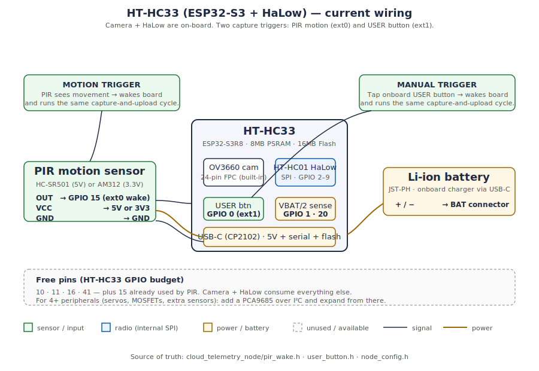

# HT-HC33 wiring — current state

A quick block diagram of how the cloud-telemetry node is wired today, plus
which pins are still free for new peripherals. The HT-HC33's camera and HaLow
radio are on-board; the only external part so far is the PIR motion sensor.

> Not a formal schematic — there is no KiCad/Eagle source for this board.
> The diagram below is generated from the pin defines in
> [`cloud_telemetry_node/`](../cloud_telemetry_node/).

## Pin table

| GPIO        | Role                       | Notes / source                                                                                          |
|-------------|----------------------------|---------------------------------------------------------------------------------------------------------|
| 0           | USER button — **manual "capture now"** (ext1 wake) | Onboard. Tap wakes board + runs the same capture-and-upload cycle as a PIR event. Also boot strap pin — TAP only, never hold. [`user_button.h`](../cloud_telemetry_node/user_button.h) |
| 1           | Battery ADC (VBAT ÷ 2)     | `BAT_ADC_PIN` in [`node_config.h`](../cloud_telemetry_node/node_config.h)                                |
| 20          | Battery ADC enable         | `BAT_ADC_CTRL_PIN` (also USB_P; unused since we use the CP2102)                                          |
| 2 – 9       | HaLow radio (internal SPI) | Reserved by the HT-HC01 — do **not** repurpose                                                          |
| 15          | PIR OUT (ext0 wake)        | `PIR_PIN` in [`pir_wake.h`](../cloud_telemetry_node/pir_wake.h)                                          |
| 10, 11, 16, 41 | **Free**                | Available for new peripherals — see GPIO budget below                                                    |
| (camera bus) | OV3660 via 24-pin FPC     | Factory pin map; do not touch the I²C used for auto-exposure                                             |

## GPIO budget — quick rules

- The camera + HaLow eat most pins. After PIR you have roughly **4 free pins**
  (10, 11, 16, 41). If you need more, add a **PCA9685** over I²C and drive
  servos / MOSFETs / LEDs from that.
- The PIR has to stay on an **RTC-capable** GPIO so deep-sleep `ext0` motion
  wake works (GPIO 15 is fine).
- Power: USB-C feeds the board *and* charges a Li-ion via JST-PH. There's no
  separate power switch — pull USB or unplug battery to fully cut power.

See also: [`docs/pir-capture-pipeline-plan.md`](pir-capture-pipeline-plan.md),
[`docs/for-students/glossary.md`](for-students/glossary.md), and the
[HT-HC33 SD test README](../hardware-tests/HT-HC33_SDTest/README.md).
